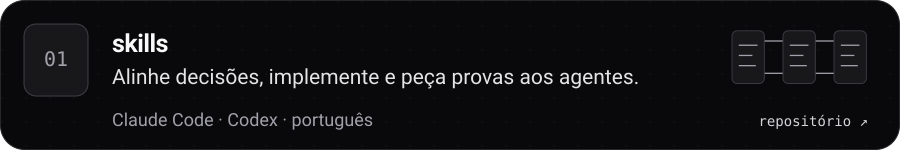

<picture>
  <source media="(prefers-reduced-motion: reduce) and (max-width: 480px)" srcset="assets/banner-mobile-still.svg">
  <source media="(prefers-reduced-motion: reduce) and (max-width: 585px), (prefers-reduced-motion: reduce) and (min-width: 768px) and (max-width: 905px)" srcset="assets/banner-compact-still.svg">
  <source media="(prefers-reduced-motion: reduce) and (max-width: 1011px)" srcset="assets/banner-medium-still.svg">
  <source media="(prefers-reduced-motion: reduce)" srcset="assets/banner-still.svg">
  <source media="(max-width: 480px)" srcset="assets/banner-mobile.svg">
  <source media="(max-width: 585px), (min-width: 768px) and (max-width: 905px)" srcset="assets/banner-compact.svg">
  <source media="(max-width: 1011px)" srcset="assets/banner-medium.svg">
  
</picture>

[LinkedIn](https://www.linkedin.com/in/jordy-fontoura/) · [E-mail](mailto:jordyfontoura@outlook.com) · [Projetos](#projetos-abertos) · [Sem animação](README-static.md)

Sou desenvolvedor full stack sênior, com experiência em liderança técnica. Já coloquei uma aplicação com LLM em produção e dei suporte após o lançamento. Quero continuar próximo do código e das decisões técnicas.

Busco uma posição remota como engenheiro de IA ou engenheiro de software com foco em IA aplicada.

## Experiência selecionada

### Dois na Oito · Senior Full Stack Developer

jan/2025–set/2026

Implementei RAG, agentes conversacionais e integração MCP em uma aplicação de atendimento com IA. Em outros produtos, desenvolvi APIs para web e mobile e recursos de recomendação de leitura, personalização, visualização de dados e controle de acesso.

### Bonaparte · Líder técnico

fev/2024–jan/2025

Liderei uma equipe técnica e trabalhei com NestJS e Google Cloud.

### Bonaparte · Backend/DevOps, Backend Sênior e Full Stack

jan/2021–ago/2023

Na primeira passagem pela empresa, desenvolvi microsserviços e trabalhei com arquitetura, modelagem de dados e testes.

Em projetos privados, também desenvolvi fluxos de processamento de documentos com LLMs e trabalhei com síntese de voz e comparação de modelos usando Python e PyTorch. A maior parte do meu trabalho com IA está em repositórios privados.

## Projetos abertos

<a href="https://github.com/jordyfontoura/skills">
<picture>
  <source media="(prefers-reduced-motion: reduce) and (max-width: 480px)" srcset="assets/project-skills-mobile-still.svg">
  <source media="(prefers-reduced-motion: reduce) and (max-width: 585px), (prefers-reduced-motion: reduce) and (min-width: 768px) and (max-width: 905px)" srcset="assets/project-skills-compact-still.svg">
  <source media="(prefers-reduced-motion: reduce) and (max-width: 1011px)" srcset="assets/project-skills-medium-still.svg">
  <source media="(prefers-reduced-motion: reduce)" srcset="assets/project-skills-still.svg">
  <source media="(max-width: 480px)" srcset="assets/project-skills-mobile.svg">
  <source media="(max-width: 585px), (min-width: 768px) and (max-width: 905px)" srcset="assets/project-skills-compact.svg">
  <source media="(max-width: 1011px)" srcset="assets/project-skills-medium.svg">
  
</picture>
</a>

<a href="https://github.com/jordyfontoura/TryLess">
<picture>
  <source media="(prefers-reduced-motion: reduce) and (max-width: 480px)" srcset="assets/project-tryless-mobile-still.svg">
  <source media="(prefers-reduced-motion: reduce) and (max-width: 585px), (prefers-reduced-motion: reduce) and (min-width: 768px) and (max-width: 905px)" srcset="assets/project-tryless-compact-still.svg">
  <source media="(prefers-reduced-motion: reduce) and (max-width: 1011px)" srcset="assets/project-tryless-medium-still.svg">
  <source media="(prefers-reduced-motion: reduce)" srcset="assets/project-tryless-still.svg">
  <source media="(max-width: 480px)" srcset="assets/project-tryless-mobile.svg">
  <source media="(max-width: 585px), (min-width: 768px) and (max-width: 905px)" srcset="assets/project-tryless-compact.svg">
  <source media="(max-width: 1011px)" srcset="assets/project-tryless-medium.svg">
  
</picture>
</a>

<a href="https://github.com/jordyfontoura/gitclean">
<picture>
  <source media="(prefers-reduced-motion: reduce) and (max-width: 480px)" srcset="assets/project-gitclean-mobile-still.svg">
  <source media="(prefers-reduced-motion: reduce) and (max-width: 585px), (prefers-reduced-motion: reduce) and (min-width: 768px) and (max-width: 905px)" srcset="assets/project-gitclean-compact-still.svg">
  <source media="(prefers-reduced-motion: reduce) and (max-width: 1011px)" srcset="assets/project-gitclean-medium-still.svg">
  <source media="(prefers-reduced-motion: reduce)" srcset="assets/project-gitclean-still.svg">
  <source media="(max-width: 480px)" srcset="assets/project-gitclean-mobile.svg">
  <source media="(max-width: 585px), (min-width: 768px) and (max-width: 905px)" srcset="assets/project-gitclean-compact.svg">
  <source media="(max-width: 1011px)" srcset="assets/project-gitclean-medium.svg">
  
</picture>
</a>

<a href="https://github.com/jordyfontoura/np">
<picture>
  <source media="(prefers-reduced-motion: reduce) and (max-width: 480px)" srcset="assets/project-np-mobile-still.svg">
  <source media="(prefers-reduced-motion: reduce) and (max-width: 585px), (prefers-reduced-motion: reduce) and (min-width: 768px) and (max-width: 905px)" srcset="assets/project-np-compact-still.svg">
  <source media="(prefers-reduced-motion: reduce) and (max-width: 1011px)" srcset="assets/project-np-medium-still.svg">
  <source media="(prefers-reduced-motion: reduce)" srcset="assets/project-np-still.svg">
  <source media="(max-width: 480px)" srcset="assets/project-np-mobile.svg">
  <source media="(max-width: 585px), (min-width: 768px) and (max-width: 905px)" srcset="assets/project-np-compact.svg">
  <source media="(max-width: 1011px)" srcset="assets/project-np-medium.svg">
  
</picture>
</a>

<a href="https://github.com/jordyfontoura/argus">
<picture>
  <source media="(prefers-reduced-motion: reduce) and (max-width: 480px)" srcset="assets/project-argus-mobile-still.svg">
  <source media="(prefers-reduced-motion: reduce) and (max-width: 585px), (prefers-reduced-motion: reduce) and (min-width: 768px) and (max-width: 905px)" srcset="assets/project-argus-compact-still.svg">
  <source media="(prefers-reduced-motion: reduce) and (max-width: 1011px)" srcset="assets/project-argus-medium-still.svg">
  <source media="(prefers-reduced-motion: reduce)" srcset="assets/project-argus-still.svg">
  <source media="(max-width: 480px)" srcset="assets/project-argus-mobile.svg">
  <source media="(max-width: 585px), (min-width: 768px) and (max-width: 905px)" srcset="assets/project-argus-compact.svg">
  <source media="(max-width: 1011px)" srcset="assets/project-argus-medium.svg">
  
</picture>
</a>

Pacotes publicados: [TryLess no npm](https://www.npmjs.com/package/tryless) · [gitclean no crates.io](https://crates.io/crates/gitclean) · [np no crates.io](https://crates.io/crates/np-cli).

## Tecnologias de trabalho

- **IA aplicada:** Python, PyTorch, Vercel AI SDK, OpenAI SDK e PostgreSQL/pgvector.
- **Backend:** TypeScript, Node.js, NestJS e Fastify.
- **Web:** React/Next.js e Vue/Nuxt.js.
- **Infraestrutura:** Docker, Kubernetes, AWS e Google Cloud.
- **Rust:** CLIs e aplicativos desktop em projetos pessoais e abertos.

## No meu terminal

Uso Claude Code, Codex e modelos locais como agentes de programação. Alinho o objetivo e o contexto do projeto, especifico o que precisa de definição, reviso o código e executo testes e verificações. Mantenho instruções para esse fluxo no repositório [skills](https://github.com/jordyfontoura/skills).

Uso de agentes de programação: volume diário e distribuição de tokens

<picture>
  <source media="(max-width: 480px)" srcset="assets/agent-usage-mobile.svg">
  <source media="(max-width: 585px), (min-width: 768px) and (max-width: 905px)" srcset="assets/agent-usage-compact.svg">
  <source media="(max-width: 1011px)" srcset="assets/agent-usage-medium.svg">
  
</picture>

## Fora do terminal

Amo minha esposa e meus dois gatos. Comecei a programar aos 10 anos com **RPG Maker**, passei pelo frontend e estudei matemática computacional na faculdade. No tempo livre, faço ferramentas abertas, jogo e às vezes crio meus próprios jogos.

---

**Vamos conversar.**

[LinkedIn](https://www.linkedin.com/in/jordy-fontoura/) · [jordyfontoura@outlook.com](mailto:jordyfontoura@outlook.com)
